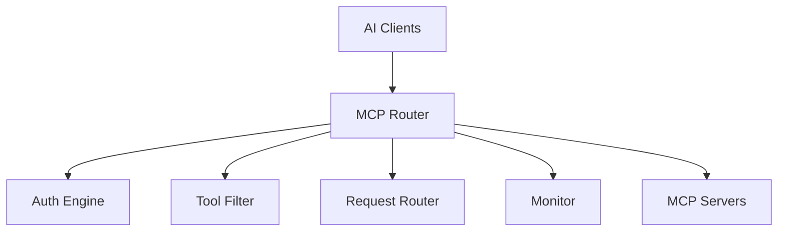

# MCP Router

[](LICENSE.md)
[](https://nodejs.org)
[](https://www.typescriptlang.org/)
[](https://www.electronjs.org/)

A powerful desktop application for orchestrating Model Context Protocol servers with enterprise-grade control, monitoring, and security.

## 📋 Overview

MCP Router acts as a unified control plane for managing multiple MCP servers, providing fine-grained tool management, client isolation, and comprehensive monitoring. It solves the complexity of juggling multiple server connections, managing permissions, and tracking tool usage across different AI applications.

## ✨ Features

- **🎛️ Advanced Tool Management** - Enable/disable, rename, and customize tools per server or client
- **🔐 Multi-Layer Authentication** - OAuth 2.1, Bearer tokens, and API key support
- **👥 Client Isolation** - Different tool sets for different API clients
- **📊 Real-time Monitoring** - Comprehensive logging and performance metrics
- **🚀 Performance Optimized** - In-memory caching, connection pooling, lazy loading
- **🛡️ Security First** - Local storage, encrypted credentials, audit logging
- **🔌 Universal Compatibility** - Support for any MCP server (local/remote)

## 🚀 Quick Start

### Prerequisites

- Node.js >= 20.0.0
- pnpm >= 8.0.0
- Windows 10+ or macOS 10.15+

### Installation

```bash
# Clone the repository
git clone https://github.com/SShadowS/mcp-router.git
cd mcp-router

# Install dependencies
pnpm install

# Start development
pnpm dev

# Build for production
pnpm build
```

### Download Pre-built

Get the latest release from [GitHub Releases](https://github.com/SShadowS/mcp-router/releases)

## 🛠️ Tools

### Tool Management System

Control every aspect of tool exposure:

```typescript
// Configure tools per client
{
  "production": {
    "tools": {
      "read_file": { enabled: true },
      "write_file": { enabled: false },
      "execute": { 
        enabled: true,
        customName: "safe_execute"
      }
    }
  },
  "development": {
    "tools": ["*"]  // Full access
  }
}
```

### Supported Configurations

- **Manual** - Direct server configuration
- **JSON** - Import from MCP settings
- **DXT** - DXT configuration format

## 🏗️ Architecture



### Tech Stack

- **Frontend**: React, TypeScript, Tailwind CSS
- **Backend**: Electron, Node.js
- **Database**: SQLite (better-sqlite3)
- **Build**: Webpack, Turbo
- **Testing**: Playwright

## 💻 Development

### Project Structure

```
mcp-router/
├── apps/
│   ├── electron/      # Desktop application
│   └── cli/           # Command line interface
├── packages/
│   ├── shared/        # Common types & utilities
│   └── ui/            # Shared components
└── docs/              # Documentation
```

### Commands

```bash
pnpm dev          # Start development server
pnpm build        # Build all packages
pnpm typecheck    # Run type checking
pnpm test:e2e     # Run end-to-end tests
pnpm lint:fix     # Fix linting issues
pnpm knip         # Analyze unused code
```

## 🤝 Contributing

We welcome contributions! Please follow these steps:

1. Fork the repository
2. Create your feature branch (`git checkout -b feature/amazing-feature`)
3. Commit your changes (`git commit -m 'Add amazing feature'`)
4. Push to the branch (`git push origin feature/amazing-feature`)
5. Open a Pull Request

## 📅 Roadmap

- [ ] Plugin system for custom extensions
- [ ] Cloud sync for configurations
- [ ] Advanced analytics dashboard
- [ ] Multi-workspace support
- [ ] Tool marketplace integration
- [ ] Performance profiling tools
- [ ] Automated testing framework

## 📞 Support

- **Issues**: [GitHub Issues](https://github.com/SShadowS/mcp-router/issues)
- **Discussions**: [GitHub Discussions](https://github.com/SShadowS/mcp-router/discussions)
- **Documentation**: Check `/docs` folder

## 🙏 Acknowledgments

Built upon the foundation of the [original MCP Router](https://github.com/mcp-router/mcp-router). Special thanks to the original creators and the MCP community for their contributions.

## 📄 License

This project is licensed under the Sustainable Use License - see [LICENSE.md](LICENSE.md) for details.

---

<p align="center">
Built with ❤️ by the MCP Router Community
</p>