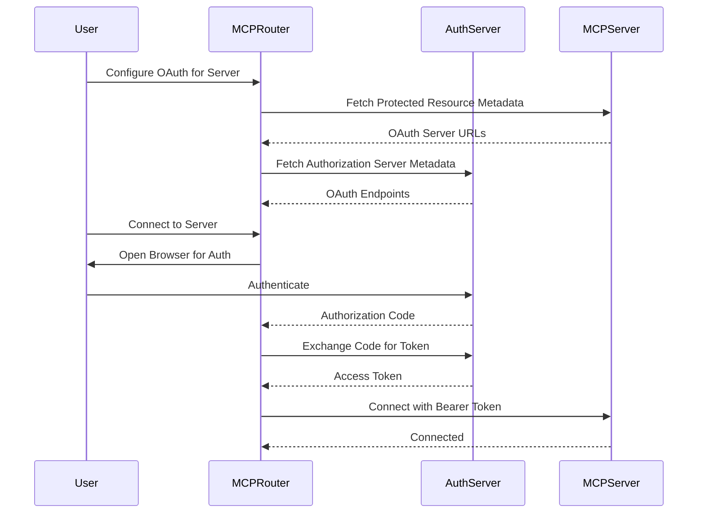

# OAuth Authentication Support for MCP Servers - Development Plan

## Executive Summary

This document outlines the comprehensive development plan for implementing OAuth 2.1 authentication support in MCP Router, enabling connections to OAuth-protected MCP servers such as GitHub, Google, Slack, and other enterprise services.

## Architecture Overview

### Authentication Flow Options

1. **MCP Router Managed OAuth** (Primary)
   - User authenticates through MCP Router's Electron BrowserWindow
   - MCP Router manages token lifecycle (storage, refresh, validation)
   - Tokens are injected into MCP client connections automatically

2. **Direct MCP OAuth** (Secondary)
   - MCP client handles OAuth flow directly with the authorization server
   - MCP Router passes through OAuth configuration to the client
   - Suitable for advanced users and specific enterprise scenarios

### System Components

```
┌─────────────────┐     ┌──────────────────┐     ┌─────────────────┐
│   MCP Router    │────▶│  OAuth Service   │────▶│   Auth Server   │
│   (Electron)    │     │   (Internal)     │     │   (External)    │
└─────────────────┘     └──────────────────┘     └─────────────────┘
         │                       │
         ▼                       ▼
┌─────────────────┐     ┌──────────────────┐
│   MCP Client    │     │  Token Storage   │
│   (SDK)         │     │   (Encrypted)    │
└─────────────────┘     └──────────────────┘
```

## Development Phases

### Phase 1: Foundation (Week 1)
**Goal: Establish OAuth infrastructure and data models**

#### Tasks:
1. **Define OAuth Types** (`oauth-types.ts`)
   ```typescript
   interface OAuthConfig {
     authType: 'none' | 'bearer' | 'oauth';
     authServerUrl?: string;
     clientId?: string;
     clientSecret?: string;
     scopes?: string[];
     grantType?: 'authorization_code' | 'client_credentials';
     tokenEndpoint?: string;
     authorizationEndpoint?: string;
     dynamicRegistration?: boolean;
   }
   
   interface OAuthToken {
     accessToken: string;
     refreshToken?: string;
     expiresAt: number;
     tokenType: string;
     scopes?: string[];
   }
   ```

2. **Database Schema Updates**
   - Create migration for `server_oauth_configs` table
   - Create migration for `server_oauth_tokens` table
   - Implement encryption for sensitive fields

3. **Repository Layer**
   - Implement `ServerOAuthRepository`
   - Add CRUD operations for OAuth configs and tokens
   - Include encryption/decryption logic

#### Deliverables:
- [ ] OAuth type definitions
- [ ] Database migrations
- [ ] Repository implementation with tests
- [ ] Encryption utilities for tokens

### Phase 2: OAuth Service Implementation (Week 1-2)
**Goal: Core OAuth flow implementation with discovery and token management**

#### Tasks:
1. **OAuth Discovery Service**
   ```typescript
   class OAuthDiscoveryService {
     async discoverAuthServer(serverUrl: string)
     async fetchAuthServerMetadata(metadataUrl: string)
     async fetchProtectedResourceMetadata(serverUrl: string)
   }
   ```

2. **OAuth Flow Service**
   ```typescript
   class OAuthFlowService {
     async initiateAuthFlow(config: OAuthConfig)
     async handleCallback(code: string, state: string)
     async exchangeCodeForToken(code: string, verifier: string)
     async refreshAccessToken(refreshToken: string)
   }
   ```

3. **Token Management Service**
   ```typescript
   class TokenManagerService {
     async storeToken(serverId: string, token: OAuthToken)
     async getValidToken(serverId: string): Promise<string>
     async validateToken(token: string): Promise<boolean>
     async revokeToken(serverId: string)
   }
   ```

4. **Dynamic Client Registration**
   - Implement RFC 7591 Dynamic Client Registration
   - Auto-register clients when connecting to new servers

#### Deliverables:
- [ ] OAuth discovery with metadata fetching
- [ ] Authorization code flow with PKCE
- [ ] Token storage and lifecycle management
- [ ] Automatic token refresh logic
- [ ] Dynamic client registration support

### Phase 3: UI Components (Week 2)
**Goal: User-friendly OAuth configuration and management interface**

#### Tasks:
1. **OAuth Configuration Modal**
   ```tsx
   <OAuthConfigModal>
     - OAuth provider selection (predefined + custom)
     - Automatic discovery from server URL
     - Manual configuration option
     - Scope selection
     - Test connection button
   </OAuthConfigModal>
   ```

2. **OAuth Status Components**
   ```tsx
   <OAuthStatusIndicator>
     - Connection status (authenticated/expired/error)
     - Token expiry countdown
     - Quick re-authenticate action
   </OAuthStatusIndicator>
   ```

3. **Server Modal Integration**
   - Add OAuth section to existing ServerModal
   - Conditional display based on server type
   - OAuth configuration validation

#### Deliverables:
- [ ] OAuth configuration modal with discovery
- [ ] Status indicators and management UI
- [ ] Integration with existing server setup flow
- [ ] User-friendly error messages and guidance

### Phase 4: MCP Client Integration (Week 2-3)
**Goal: Seamless OAuth integration with MCP client connections**

#### Tasks:
1. **Enhance `connectToMCPServer` Function**
   ```typescript
   async function connectToMCPServer(server: MCPServerConfig) {
     // Check OAuth requirements
     if (server.authType === 'oauth') {
       const token = await tokenManager.getValidToken(server.id);
       // Add token to transport configuration
     }
     // ... existing connection logic
   }
   ```

2. **Transport-specific Implementation**
   - HTTP transports: Add Bearer token to headers
   - SSE transport: Include token in EventSource headers
   - WebSocket: Add token to connection parameters

3. **Error Handling**
   - Intercept 401 Unauthorized responses
   - Automatic token refresh on expiry
   - User notification for re-authentication

#### Deliverables:
- [ ] OAuth-aware MCP client connection
- [ ] Automatic token injection
- [ ] 401 response handling with refresh
- [ ] Graceful degradation for non-OAuth servers

### Phase 5: Security Hardening (Week 3)
**Goal: Ensure secure OAuth implementation following best practices**

#### Tasks:
1. **Security Measures**
   - Implement secure token storage with electron-store
   - Add PKCE for all authorization code flows
   - Validate redirect URIs and state parameters
   - Implement token rotation

2. **Audit and Compliance**
   - Security audit of OAuth flow
   - Compliance with OAuth 2.1 specifications
   - Penetration testing scenarios

3. **Rate Limiting and Throttling**
   - Implement rate limiting for token refresh
   - Backoff strategy for failed requests

#### Deliverables:
- [ ] Encrypted token storage
- [ ] PKCE implementation
- [ ] Security audit report
- [ ] Rate limiting and error recovery

### Phase 6: Advanced Features (Week 3-4)
**Goal: Enhanced OAuth capabilities for enterprise use cases**

#### Tasks:
1. **Multiple OAuth Providers**
   - Support for different OAuth providers per server
   - Provider-specific configurations (GitHub, Google, Azure AD)
   - Custom OAuth provider support

2. **Client-specific OAuth**
   - Different OAuth configs per API client
   - Client-based token isolation
   - Multi-tenant support

3. **OAuth Provider Templates**
   ```typescript
   const providers = {
     github: {
       authUrl: 'https://github.com/login/oauth/authorize',
       tokenUrl: 'https://github.com/login/oauth/access_token',
       scopes: ['repo', 'user']
     },
     google: { /* ... */ },
     slack: { /* ... */ }
   }
   ```

#### Deliverables:
- [ ] Multi-provider support
- [ ] Provider templates for common services
- [ ] Client-specific OAuth configurations
- [ ] Import/export OAuth configurations

### Phase 7: Testing and Documentation (Week 4)
**Goal: Comprehensive testing and user documentation**

#### Tasks:
1. **Testing Suite**
   - Unit tests for OAuth services
   - Integration tests with mock OAuth server
   - E2E tests for complete OAuth flow
   - Test with real OAuth providers (GitHub, Google)

2. **Documentation**
   - User guide for OAuth setup
   - Troubleshooting guide
   - Developer documentation for OAuth APIs
   - Video tutorials for common scenarios

3. **Example Configurations**
   - Sample configs for popular services
   - Docker compose for testing OAuth servers
   - Postman collection for OAuth testing

#### Deliverables:
- [ ] Complete test coverage (>80%)
- [ ] User documentation
- [ ] Developer API documentation
- [ ] Example configurations and tutorials

## Technical Implementation Details

### OAuth Flow Sequence



### File Structure

```
apps/electron/src/
├── main/
│   ├── domain/
│   │   └── mcp-core/
│   │       └── oauth/
│   │           ├── oauth-service.ts
│   │           ├── oauth-discovery.ts
│   │           ├── oauth-flow.ts
│   │           ├── token-manager.ts
│   │           └── oauth-types.ts
│   ├── infrastructure/
│   │   ├── database/
│   │   │   ├── schema/
│   │   │   │   └── tables/
│   │   │   │       └── server-oauth.ts
│   │   │   └── repositories/
│   │   │       └── server-oauth-repository.ts
│   │   └── ipc/
│   │       └── handlers/
│   │           └── oauth-handler.ts
│   └── application/
│       └── mcp-core/
│           └── mcp-manager/
│               └── oauth-integration.ts
└── renderer/
    └── components/
        └── mcp/
            └── server/
                ├── OAuthConfigModal.tsx
                ├── OAuthStatusIndicator.tsx
                └── OAuthProviderSelector.tsx
```

## Risk Mitigation

### Identified Risks

1. **Token Security**
   - Risk: Token theft or exposure
   - Mitigation: Encryption at rest, secure memory handling

2. **OAuth Provider Compatibility**
   - Risk: Different OAuth implementations
   - Mitigation: Provider-specific adapters, extensive testing

3. **Token Expiry During Operations**
   - Risk: Operations failing due to expired tokens
   - Mitigation: Proactive refresh, retry mechanisms

4. **User Experience Complexity**
   - Risk: OAuth setup too complex for users
   - Mitigation: Auto-discovery, templates, clear documentation

## Success Metrics

- **Functional Metrics**
  - Successfully connect to 5+ different OAuth providers
  - Automatic token refresh success rate > 99%
  - OAuth flow completion rate > 95%

- **Performance Metrics**
  - OAuth flow completion < 10 seconds
  - Token refresh < 2 seconds
  - Discovery process < 3 seconds

- **Security Metrics**
  - Zero token exposure incidents
  - Pass security audit
  - Compliance with OAuth 2.1 spec

## Migration Strategy

For existing MCP Router users:
1. OAuth support is opt-in per server
2. Existing bearer token configs remain unchanged
3. Gradual migration path with clear benefits
4. Import tool for existing OAuth configs

## Future Enhancements

- **Phase 8+**: Advanced Features
  - OAuth proxy mode for legacy MCP servers
  - Federation support for enterprise SSO
  - OAuth token sharing between servers
  - Biometric authentication for token access
  - OAuth analytics and monitoring dashboard

## Conclusion

This phased approach ensures a robust, secure, and user-friendly OAuth implementation that enhances MCP Router's capability to connect with enterprise-grade MCP servers while maintaining backward compatibility and ease of use.

## Appendix

### A. OAuth 2.1 Compliance Checklist
- [ ] Authorization Code flow with PKCE
- [ ] Client Credentials flow support
- [ ] Token introspection
- [ ] Token revocation
- [ ] Dynamic Client Registration
- [ ] Authorization Server Metadata
- [ ] Protected Resource Metadata

### B. Supported OAuth Providers (Initial)
- GitHub
- Google
- Microsoft Azure AD
- Slack
- GitLab
- Bitbucket
- Custom OAuth 2.1 providers

### C. References
- [RFC 6749 - OAuth 2.0](https://tools.ietf.org/html/rfc6749)
- [OAuth 2.1 Draft](https://oauth.net/2.1/)
- [MCP Authorization Spec](https://modelcontextprotocol.io/specification/draft/basic/authorization)
- [RFC 7591 - Dynamic Client Registration](https://tools.ietf.org/html/rfc7591)
- [RFC 8414 - Authorization Server Metadata](https://tools.ietf.org/html/rfc8414)
- [RFC 9728 - Protected Resource Metadata](https://tools.ietf.org/html/rfc9728)